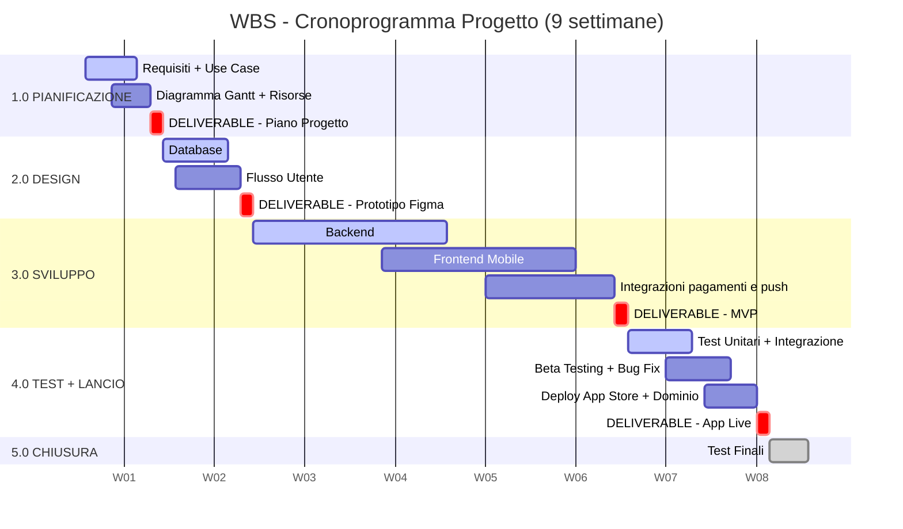

# Titolo: 
### MySociety

---

# Descrizione: 
mySociety è un’applicazione mobile innovativa pensata per rendere semplice e intuitiva la gestione delle associazioni e società di ogni tipo, dalle realtà sportive e culturali fino ai gruppi scolastici, musicali o di volontariato. L’app si basa su un sistema di registrazione flessibile, pensato sia per i singoli utenti sia per chi amministra una società. Ogni persona, una volta creata la propria utenza, può iscriversi liberamente a più società contemporaneamente, semplicemente inserendo un codice o seguendo un link di invito fornito dai responsabili. In questo modo, l’utente può passare facilmente da un gruppo all’altro, mantenendo sempre tutto organizzato all’interno della stessa applicazione.
All’interno di ciascuna società, l’utente può consultare la bacheca digitale, dove vengono pubblicati avvisi e comunicazioni ufficiali, oltre a poter visualizzare il calendario con eventi, riunioni o attività programmate. Tutto è pensato per favorire trasparenza, ordine e partecipazione attiva. Ogni membro può conoscere i ruoli degli altri iscritti, scoprire i prossimi appuntamenti e restare costantemente aggiornato sulle decisioni o le novità del proprio gruppo.
Parallelamente, i gestori o amministratori delle società dispongono di un vero e proprio pannello gestionale, attraverso il quale possono organizzare l’intera struttura dell’associazione in maniera chiara e gerarchica. Possono inserire nuovi membri, creare sottosezioni o sottosocietà autonome (ad esempio per diverse squadre o gruppi interni), impostare ruoli e permessi personalizzati, inviare comunicazioni e avere accesso a un gestionale facile e intuitivo per tenere traccia delle varie quote associative di ogni associato, controllando pagamenti e scadenze in tempo reale. La piattaforma, inoltre, consente di far circolare automaticamente gli annunci generali verso tutte le sottosocietà collegate, garantendo una comunicazione coerente e immediata lungo tutta la catena organizzativa.
Per creare una Associazione/Società bisogna sottoiscrevere un abbonamento Mensile o Annuale dove in base al numero di associati, sottoassociazioni e plugin con funzionalità avanzate.

---

# Problema: 
Nasce per risolvere la gestione frammentata e confusa tipica di molte associazioni che ancora si affidano a Excel, chat whatsapp per comunicazioni con gli associatri e email separate per organizzare iscrizioni, quote e comunicazioni. Questi metodi portano facilmente a errori, ritardi, dati non aggiornati e perdita di tempo.
L’app centralizza tutto in un unico ambiente digitale accessibile da smartphone: soci, pagamenti, eventi, annunci e sottosocietà vengono gestiti in modo ordinato e condiviso. In questo modo le associazioni migliorano la comunicazione interna, risparmiano tempo e mantengono sempre sotto controllo la propria organizzazione.

---

# Target: 
Società e Associazioni di piccole, medie dimensioni. Soprattutto società sportive, ma utile anche a circoli e comitati e federazioni che hanno esigenze di gestire in maniera comoda quote, annunci, calendario ed eventi.

---
# Tagline:
"La Società sempre sotto il tuo controllo"

---

# Tecnologie Utilizzate:
Frontend Mobile.  
Backend.  
Database.   
Autenticazione.  
Cloud Storage.  

---

  # Requisiti – mySociety

## Funzionali &nbsp; 
> Funzionalità offerte agli utenti

-  Registrazione di singoli utenti con creazione di un'utenza personale
-  Iscrizione a più società contemporaneamente tramite codice o link di invito
-  Visualizzazione della bacheca digitale con avvisi e comunicazioni ufficiali
-  Visualizzazione del calendario con eventi, riunioni e attività programmate
-  Pannello gestionale per amministratori per organizzare la struttura dell'associazione
-  Inserimento di nuovi membri da parte degli amministratori
-  Creazione di sottosezioni o sottosocietà autonome (es. squadre, gruppi interni)
-  Impostazione di ruoli e permessi personalizzati per i membri
-  Invio di comunicazioni da parte degli amministratori
-  Gestione delle quote associative con tracciamento di pagamenti e scadenze
-  Diffusione automatica degli annunci verso tutte le sottosocietà collegate
-  Sottoscrizione di abbonamento mensile o annuale per creare una società
-  Selezione del piano in base a associati, sottosocietà e plugin

## Non Funzionali &nbsp; 
> Qualità, performance, usabilità

-  **Usabilità:** interfaccia semplice e intuitiva, adatta a utenti non tecnici
-  **Portabilità:** applicazione mobile compatibile con iOS e/o Android
-  **Scalabilità:** supporto a società di dimensioni variabili
-  **Tempestività:** aggiornamenti e comunicazioni in tempo reale
-  **Organizzazione:** gestione gerarchica e strutturata delle associazioni
-  **Affidabilità:** tracciamento preciso di pagamenti e scadenze delle quote

## Di Dominio &nbsp; Regole e vincoli del contesto
> Specificità del mondo associativo

-  Una società può essere di qualsiasi tipo: sportiva, culturale, scolastica, musicale, di volontariato, ecc.
-  Un utente può appartenere a più società contemporaneamente
-  L'accesso avviene tramite codice o link di invito fornito dai responsabili
-  Ogni società può avere una struttura interna gerarchica con sottosocietà autonome
-  Esistono ruoli distinti all'interno di una società (membro, gestore/amministratore)
-  Gli amministratori hanno poteri gestionali estesi non disponibili ai membri ordinari
-  Le comunicazioni generali si propagano automaticamente alle sottosocietà
-  La creazione di una società è vincolata alla sottoscrizione di un abbonamento a pagamento

---

# Competitors:

---

# Use Case Diagram:

---

## User Story:
| **Attore (Come...)** | **Requisito / Azione (Voglio...)** | **Beneficio (In modo da...)** |
| --- | --- | --- |
| Utente | registrarmi alla piattaforma | creare un account e accedere ai servizi dell'app |
| Utente | effettuare il login | accedere al mio profilo e alle funzionalità riservate |
| Utente | recuperare la password | ripristinare l'accesso in caso di smarrimento |
| Utente | gestire il mio profilo | aggiornare i dati personali e le preferenze |
| Utente | iscrivermi a una società tramite codice o link | entrare a far parte di un'associazione in modo semplice e rapido |
| Utente | visualizzare la bacheca digitale della società | leggere avvisi e comunicazioni ufficiali del gruppo |
| Utente | consultare il calendario eventi della società | conoscere riunioni, attività e appuntamenti programmati |
| Utente | visualizzare i ruoli degli altri iscritti | sapere chi svolge quale funzione all'interno della società |
| Utente | essere iscritto a più società contemporaneamente | gestire tutti i miei gruppi in un'unica applicazione |
| Utente | ricevere notifiche push dagli amministratori | restare aggiornato in tempo reale sulle novità del gruppo |
| Utente | visualizzare lo stato delle mie quote associative | sapere quali pagamenti ho effettuato e quali sono in scadenza |
| Amministratore | effettuare il login con privilegi di gestione | accedere al pannello amministrativo della società |
| Amministratore | creare e configurare una nuova società | avviare e personalizzare la struttura della mia associazione |
| Amministratore | aggiungere e rimuovere membri dalla società | mantenere aggiornato l'elenco degli iscritti |
| Amministratore | creare sottosezioni o sottosocietà interne | organizzare squadre o gruppi distinti all'interno della stessa associazione |
| Amministratore | assegnare ruoli e permessi personalizzati ai membri | definire chi può accedere a quali funzionalità |
| Amministratore | pubblicare annunci sulla bacheca | comunicare notizie e avvisi ufficiali a tutti i soci |
| Amministratore | inviare comunicazioni a tutte le sottosocietà collegate | garantire una comunicazione coerente lungo tutta la struttura |
| Amministratore | creare e gestire eventi nel calendario | pianificare attività, riunioni e appuntamenti del gruppo |
| Amministratore | gestire le quote associative degli iscritti | tenere traccia dei pagamenti e delle scadenze in tempo reale |
| Amministratore | visualizzare report sui pagamenti | monitorare lo stato finanziario dell'associazione |

---

## Implementazione:

---

## Elevator Pitch:

Elevator Pitch - MySociety

Il problema:
Le associazioni, società sportive e non  in Italia gestiscono soci, quote, annunci e comunicazioni attraverso strumenti frammentati: fogli Excel, chat WhatsApp e documenti sparsi. Questo approccio genera inefficienze operative, perdita di dati critici e mancanza di trasparenza nella gestione.

La soluzione:
mySociety è una piattaforma mobile che integra gestione soci, calcolo e promemoria quote associative, calendario eventi, bacheca, comunicazioni e molto altro. Un ecosistema digitale completo per amministrare al meglio la propria società/associazione.
Un modo per gli associati di avere tutte le informazioni in maniera comoda e sempre aggiornata. 

Market size:
In Italia operano oltre 80.000 ASD/SSD registrate, più decine di migliaia di associazioni culturali, musicali e di volontariato. 
Un mercato da €100M+ annui ancora ancorato a processi manuali e inefficienti.

Business model:
Modello SaaS (Software as a Service).                                             
Abbonamenti Mensili/Annuali: Starter, Professional, Enterprise.

Strategia di acquisizione clienti:
Il piano di acquisizione clienti si basa su tre canali principali:

1. Partnership con associazioni locali
Contatto diretto con associazioni sportive, culturali e di volontariato per presentare la piattaforma e offrire una prova gratuita.

2. Marketing digitale mirato
 Campagne pubblicitarie su:
   - Facebook
   - Instagram
   - Google Ads
   - 
3. Programma referral
 Le associazioni che utilizzano mySociety possono invitare altre società ricevendo sconti o mesi gratuiti di abbonamento.
                  
Competition:
Competitor come Golee, GeSoSport e weSpoort coprono esclusivamente il settore sportivo e molti di questi non sono neanche così ottimi. Inoltre non offrono prezzi agevolati per piccole società. mySociety si differenzia per target universale, con piani appositi per società più piccole con pochi associati e funzionalità avanzate con plugin personalizzati per società più grandi. 

Perché noi:
Idea chiara con focus sulla fetta di mercato libero: catturiamo la fetta di piccole società che oggi usano solo WhatsApp e Excel, offrendo un'esperienza semplice ed economica per le società piccole, allo stesso tempo alternative con Plugin Personalizzati e piani Enterprise per Società e Associazioni piu grandi. 

Richiesta:
Cerchiamo €100.000  in cambio del 15%  per completare sviluppo, noleggio web server, lancio commerciale (pubblicità) e acquisizione primi 1000 clienti entro 12 mesi.

---

##  WBS (Work Breakdown Structure)
Pianificazione dettagliata delle fasi di sviluppo:

```mermaid
graph TD
    A[" Progetto"] --> B["1.0  PIANIFICAZIONE\n1 settimana"]
    A --> C["2.0  DESIGN\n2 settimane"]
    A --> D["3.0  SVILUPPO\n5 settimane"]
    A --> E["4.0  TEST + LANCIO\n2 settimane"]
    A --> F["5.0  CHIUSURA"]

    B --> B1["1.1 Requisiti\n+ Use Case"]
    B --> B2["1.2 Diagramma\nGantt + Risorse"]
    B --> B3[" 1.3 Deliverable\nPiano completo"]

    C --> C1["2.1 Database"]
    C --> C2["2.2 Flusso Utente"]
    C --> C3[" 2.3 Deliverable\nPrototipo UI/UX\nFigma"]

    D --> D1["3.1 Backend"]
    D --> D2["3.2 Frontend\nMobile"]
    D --> D3["3.3 Integrazioni\npagamenti, notifiche"]
    D --> D4[" 3.4 Deliverable\nMVP"]

    E --> E1["4.1 Test Unitari\n+ Integrazione"]
    E --> E2["4.2 Beta Testing\n+ Bug Fix"]
    E --> E3["4.3 Deploy\nApp Store + Dominio"]
    E --> E4[" 4.4 Deliverable\nApp Live"]

    F --> F1["5.1 Pubblicità"]

    style A fill:#4f46e5,color:#fff,stroke:#4f46e5
    style B3 fill:#065f46,color:#fff,stroke:#065f46
    style C3 fill:#065f46,color:#fff,stroke:#065f46
    style D4 fill:#065f46,color:#fff,stroke:#065f46
    style E4 fill:#065f46,color:#fff,stroke:#065f46
```
   ---
   
## Cronoprogramma 

```mermaid
gantt
title WBS - Cronoprogramma Progetto (9 settimane)
dateFormat  YYYY-MM-DD
axisFormat  W%W

section 1.0 PIANIFICAZIONE
Requisiti + Use Case          :active,  p1a, 2025-01-09, 4d
Diagramma Gantt + Risorse     :         p1b, 2025-01-11, 3d
DELIVERABLE - Piano Progetto  :crit,    p1d, 2025-01-14, 1d

section 2.0 DESIGN
Database                      :active,  p2a, 2025-01-15, 5d
Flusso Utente                 :         p2b, 2025-01-16, 5d
DELIVERABLE - Prototipo Figma :crit,    p2d, 2025-01-21, 1d

section 3.0 SVILUPPO
Backend                       :active,  p3a, 2025-01-22, 15d
Frontend Mobile               :         p3b, 2025-02-01, 15d
Integrazioni pagamenti e push :         p3c, 2025-02-09, 10d
DELIVERABLE - MVP             :crit,    p3d, 2025-02-19, 1d

section 4.0 TEST + LANCIO
Test Unitari + Integrazione   :active,  p4a, 2025-02-20, 5d
Beta Testing + Bug Fix        :         p4b, 2025-02-23, 5d
Deploy App Store + Dominio    :         p4c, 2025-02-26, 4d
DELIVERABLE - App Live        :crit,    p4d, 2025-02-30, 1d

section 5.0 CHIUSURA
Test Finali       :done,    p5a, 2025-02-31, 3d

```
