# Titolo: 
### MySociety

# Descrizione: 
mySociety è un’applicazione mobile innovativa pensata per rendere semplice e intuitiva la gestione delle associazioni e società di ogni tipo, dalle realtà sportive e culturali fino ai gruppi scolastici, musicali o di volontariato. L’app si basa su un sistema di registrazione flessibile, pensato sia per i singoli utenti sia per chi amministra una società. Ogni persona, una volta creata la propria utenza, può iscriversi liberamente a più società contemporaneamente, semplicemente inserendo un codice o seguendo un link di invito fornito dai responsabili. In questo modo, l’utente può passare facilmente da un gruppo all’altro, mantenendo sempre tutto organizzato all’interno della stessa applicazione.
All’interno di ciascuna società, l’utente può consultare la bacheca digitale, dove vengono pubblicati avvisi e comunicazioni ufficiali, oltre a poter visualizzare il calendario con eventi, riunioni o attività programmate. Tutto è pensato per favorire trasparenza, ordine e partecipazione attiva. Ogni membro può conoscere i ruoli degli altri iscritti, scoprire i prossimi appuntamenti e restare costantemente aggiornato sulle decisioni o le novità del proprio gruppo.
Parallelamente, i gestori o amministratori delle società dispongono di un vero e proprio pannello gestionale, attraverso il quale possono organizzare l’intera struttura dell’associazione in maniera chiara e gerarchica. Possono inserire nuovi membri, creare sottosezioni o sottosocietà autonome (ad esempio per diverse squadre o gruppi interni), impostare ruoli e permessi personalizzati, inviare comunicazioni e avere accesso a un gestionale facile e intuitivo per tenere traccia delle varie quote associative di ogni associato, controllando pagamenti e scadenze in tempo reale. La piattaforma, inoltre, consente di far circolare automaticamente gli annunci generali verso tutte le sottosocietà collegate, garantendo una comunicazione coerente e immediata lungo tutta la catena organizzativa.
Per creare una Associazione/Società bisogna sottoiscrevere un abbonamento Mensile o Annuale dove in base al numero di associati, sottoassociazioni e plugin con funzionalità avanzate.

# Problema: 
Nasce per risolvere la gestione frammentata e confusa tipica di molte associazioni che ancora si affidano a Excel, chat whatsapp per comunicazioni con gli associatri e email separate per organizzare iscrizioni, quote e comunicazioni. Questi metodi portano facilmente a errori, ritardi, dati non aggiornati e perdita di tempo.
L’app centralizza tutto in un unico ambiente digitale accessibile da smartphone: soci, pagamenti, eventi, annunci e sottosocietà vengono gestiti in modo ordinato e condiviso. In questo modo le associazioni migliorano la comunicazione interna, risparmiano tempo e mantengono sempre sotto controllo la propria organizzazione.

# Target: 
Società e Associazioni di piccole, medie dimensioni. Soprattutto società sportive, ma utile anche a circoli e comitati e federazioni che hanno esigenze di gestire in maniera comoda quote, annunci, calendario ed eventi.

# Tagline:
"La Società sempre sotto il tuo controllo"

# Tecnologie Utilizzate:
Frontend Mobile.  
Backend.  
Database.   
Autenticazione.  
Cloud Storage.  
  
# Requisiti: 

[](https://docs.google.com/document/d/1xWKr9zPorj-nm3MxhnGaykbhv_UhUK95PsWAqKO3TZ0/edit?usp=sharing)


# Competitors:


# Use Case Diagram:

[](https://yuml.me/69b9d2e2.svg)


## Implementazione:

[](https://society-sync-platform.lovable.app)

## Elevator Pitch:

[](https://telegra.ph/Elevator-Pitch---MySociety-02-09)

## 🗂️ WBS (Work Breakdown Structure)
Pianificazione dettagliata delle fasi di sviluppo e relativi costi:

```mermaid
graph TD
    A["🚀 Progetto"] --> B["1.0 🗂️ PIANIFICAZIONE\n1 settimana"]
    A --> C["2.0 🎨 DESIGN\n2 settimane"]
    A --> D["3.0 ⚙️ SVILUPPO\n5 settimane"]
    A --> E["4.0 🧪 TEST + LANCIO\n2 settimane"]
    A --> F["5.0 🏁 CHIUSURA"]

    B --> B1["1.1 Requisiti\n+ Use Case"]
    B --> B2["1.2 Diagramma\nGantt + Risorse"]
    B --> B3["📦 1.3 Deliverable\nPiano completo"]

    C --> C1["2.1 Database"]
    C --> C2["2.2 Flusso Utente"]
    C --> C3["📦 2.3 Deliverable\nPrototipo UI/UX\nFigma"]

    D --> D1["3.1 Backend"]
    D --> D2["3.2 Frontend\nMobile"]
    D --> D3["3.3 Integrazioni\npagamenti, notifiche"]
    D --> D4["📦 3.4 Deliverable\nMVP"]

    E --> E1["4.1 Test Unitari\n+ Integrazione"]
    E --> E2["4.2 Beta Testing\n+ Bug Fix"]
    E --> E3["4.3 Deploy\nApp Store + Dominio"]
    E --> E4["📦 4.4 Deliverable\nApp Live"]

    F --> F1["5.1 Pubblicità"]

    style A fill:#4f46e5,color:#fff,stroke:#4f46e5
    style B3 fill:#065f46,color:#fff,stroke:#065f46
    style C3 fill:#065f46,color:#fff,stroke:#065f46
    style D4 fill:#065f46,color:#fff,stroke:#065f46
    style E4 fill:#065f46,color:#fff,stroke:#065f46
```

   
## Cronoprogramma 

```mermaid
gantt
title WBS - Cronoprogramma Progetto (9 settimane)
dateFormat  YYYY-MM-DD
axisFormat  W%W

section 1.0 PIANIFICAZIONE
Requisiti + Use Case          :active,  p1a, 2025-01-09, 4d
Diagramma Gantt + Risorse     :         p1b, 2025-01-11, 3d
DELIVERABLE - Piano Progetto  :crit,    p1d, 2025-01-14, 1d

section 2.0 DESIGN
Database                      :active,  p2a, 2025-01-15, 5d
Flusso Utente                 :         p2b, 2025-01-16, 5d
DELIVERABLE - Prototipo Figma :crit,    p2d, 2025-01-21, 1d

section 3.0 SVILUPPO
Backend                       :active,  p3a, 2025-01-22, 15d
Frontend Mobile               :         p3b, 2025-02-01, 15d
Integrazioni pagamenti e push :         p3c, 2025-02-09, 10d
DELIVERABLE - MVP             :crit,    p3d, 2025-02-19, 1d

section 4.0 TEST + LANCIO
Test Unitari + Integrazione   :active,  p4a, 2025-02-20, 5d
Beta Testing + Bug Fix        :         p4b, 2025-02-23, 5d
Deploy App Store + Dominio    :         p4c, 2025-02-26, 4d
DELIVERABLE - App Live        :crit,    p4d, 2025-02-30, 1d

section 5.0 CHIUSURA
Test Finali       :done,    p5a, 2025-02-31, 3d
